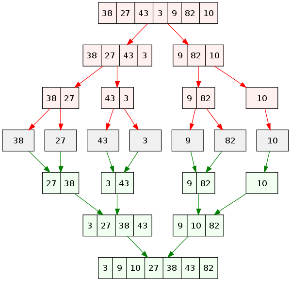
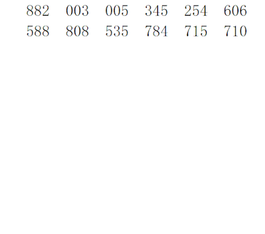
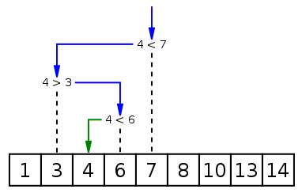
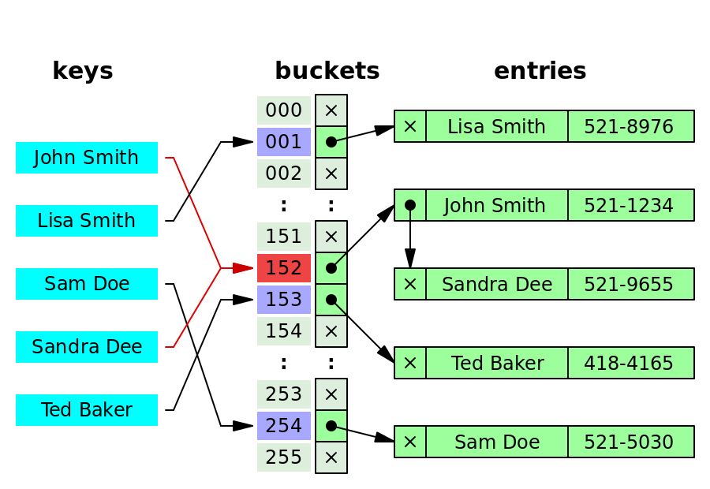

# data_structures_and_algorithms

## Plan


## Complexity Analysis

### Big-Oh

$T(n) = O(f(n))$ iff $\exist c, n_0$ s.t.
$$T(n) \leq c f(n) \quad \forall n > n_0$$

### Omega

$T(n) = \Omega(f(n))$ iff $\exist c, n_0$ s.t.
$$T(n) \geq c f(n) \quad \forall n > n_0$$

### Theta

$T(n) = \theta(f(n))$ iff $\exist c_1, c_2, n_0$ s.t.
$$c_1 f(n) \leq T(n) \leq c_2 f(n) \quad \forall n > n_0$$

### Little-Oh

$T(n) = o(f(n))$ iff $\forall c > 0, \exist n_0$ s.t.
$$T(n) \leq c f(n) \quad \forall n > n_0$$

## Linear List


### Array

数组（Array）是一种线性表数据结构。它用一组连续的内存空间，来存储一组具有相同类型的数据。


寻址公式：

```cpp
a[i]_address = base_address + i * data_type_size
```

特性：

- 下标随机访问 $O(1)$
- 插入删除 $O(n)$

### Linked List

链表（Linked List）用指针将离散的内存空间串联起来


与数组比较：


#### 跳表（skip list）


查找、插入、索引动态更新：


特性：

- 插入、删除、查找时间复杂度 $O(\log{n})$
- 空间复杂度 $O(n)$

### Stack


### Queue


#### 循环队列


#### 阻塞队列

空队列阻塞出队，满队列阻塞入队


## Sort

| 排序 | 最好          | 最坏          | 平均          | 空间     | 稳定 |
| ---- | ------------- | ------------- | ------------- | -------- | ---- |
| 冒泡 | $O(n)$        | $O(n^2)$      | $O(n^2)$      | $O(1)$   | ✅    |
| 插入 | $O(n)$        | $O(n^2)$      | $O(n^2)$      | $O(1)$   | ✅    |
| 选择 | $O(n^2)$      | $O(n^2)$      | $O(n^2)$      | $O(1)$   | ❌    |
| 归并 | $O(n\log{n})$ | $O(n\log{n})$ | $O(n\log{n})$ | $O(n)$   | ✅    |
| 快排 | $O(n\log{n})$ | $O(n^2)$      | $O(n\log{n})$ | $O(1)$   | ❌    |
| 桶   | -             | $O(n^2)$      | $O(n + k)$    | $O(nk)$  | ✅    |
| 计数 | $O(n+k)$      | $O(n+k)$      | $O(n+k)$      | $O(n+k)$ | ✅    |
| 基数 | -             | $O(n^2)$      | $O(kn)$       | $O(n+k)$ | ✅    |

### 冒泡排序


### 插入排序


### 选择排序


### 归并排序




### 快速排序


优化：

- 三数取中
- 随机

### 桶排序


### 计数排序


### 基数排序



## Search

### 线性表查找

#### 二分查找



时间复杂度：$O(\log{n})$

特点：

- 数据有序
- 数据太小太大都不适合

## Hash Table


### 散列函数

1. 非负
2. 尽可能为单射
3. 尽可能简单

例如：MD5, SHA, CRC

### 解决散列冲突

由于很难在简单函数、大定义域下做到散列函数为单射，所以我们要考虑散列冲突问题，一般有以下解决方案：

#### 开放寻址法


特点：

- 探测方式：线性探测、二次探测、双重散列
- 数据全部存在数组里，方便序列化
- 删除数据不能直接删除，那样会导致查找失效，只能先将数据标为deleted
- 插入越多时，散列冲突可能性越大，空闲位置会越少，探测的时间就会越久。

#### 链表法



链表也可替换为跳表、红黑树等

### 动态扩容

装载因子大于阈值时申请更大的空间，重新计算哈希值，插入之前的对象。但是可能会导致某次插入操作耗时过长，为了避免，可以在申请空间后每次插入的时候多搬运一个旧对象
