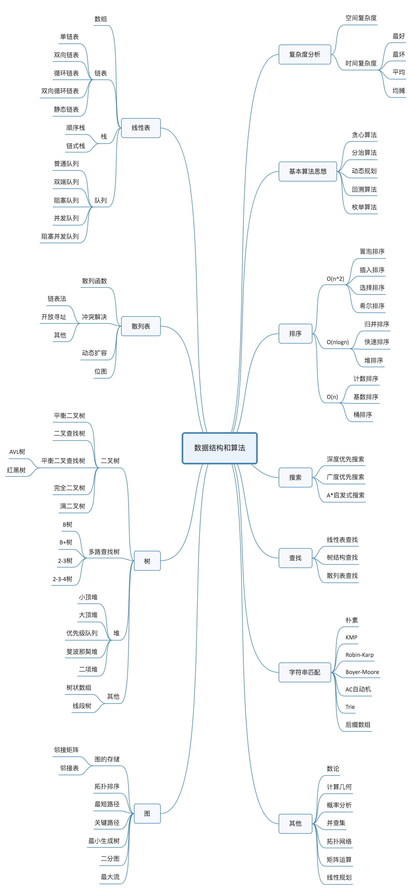

# data_structures_and_algorithms

## Plan

## Complexity Analysis

### Big-Oh

$T(n) = O(f(n))$ iff $\exist c, n_0$ s.t.
$$T(n) \leq c f(n) \quad \forall n > n_0$$

### Omega

$T(n) = \Omega(f(n))$ iff $\exist c, n_0$ s.t.
$$T(n) \geq c f(n) \quad \forall n > n_0$$

### Theta

$T(n) = \theta(f(n))$ iff $\exist c_1, c_2, n_0$ s.t.
$$c_1 f(n) \leq T(n) \leq c_2 f(n) \quad \forall n > n_0$$

### Little-Oh

$T(n) = o(f(n))$ iff $\forall c > 0, \exist n_0$ s.t.
$$T(n) \leq c f(n) \quad \forall n > n_0$$

## Linear List

### Array

